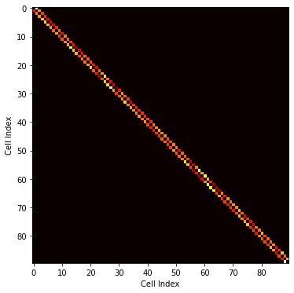

```python
import sys
import pytraj as pt
from sklearn.decomposition import PCA
import numpy as np
import matplotlib.pyplot as plt
import scipy
from scipy import spatial

from BKit.TransitionKernel import TransitionKernel
from BKit.KinSolvers import KineticsQK
```


```python
DIR_SAVE = '/home/talant/Projects/UCRiver/Milestoning/MileStoningKit/output/'
print("reading inputs from " + DIR_SAVE)
MIDX = np.load(DIR_SAVE + 'CellIndx.npy')
```

    reading inputs from /home/talant/Projects/UCRiver/Milestoning/MileStoningKit/output/


###  Collect transitions between milestones


```python
TransK = TransitionKernel(traj_size=1000, OutCellID=1000, check_escape=True)
TRANS = TransK.AllTrans(MIDX)
nM = TRANS[:,2].max()
```

    number of trajs 12020
    Total transitions =  42578


### Transition Kernel  and average lifetime of each milestone


```python
KMAT, time = TransK.Kmat_time(TRANS, nM)
ave_time = np.array(time)[:,1] # getting only time part
```


```python
fig = plt.figure(figsize=[8,6])
ax = plt.imshow(KMAT, cmap='hot')
plt.xlabel('Cell Index'); plt.ylabel('Cell Index')
```


    Text(0, 0.5, 'Cell Index')


    

    


### Solve for stationary flux, q using eigenvalue sover and power iteration


```python
# Provide appropriative boundary condition to the last milestone
bc_beg = ''
bc_end = 'reflective'
QK = KineticsQK(KMAT, ave_time, nM, bc = [bc_beg, bc_end])
PMF_power, q_power = QK.PowerIter(n_iters=30000)
PMF_eigen, q_eigen = QK.EigenSolver()

PMF_power = PMF_power - PMF_power.min()
PMF_eigen = PMF_eigen - PMF_eigen.min()
```

###  Compare q obtained from both methods


```python
cl='slategrey'
fig=plt.figure(facecolor=cl, figsize=[7,5])
plt.rcParams['axes.facecolor'] = cl
plt.plot( range(len(q_eigen)), abs(q_eigen), color='yellow', label='q from eigensolver')
plt.plot( range(len(q_power)), q_power, '--',color='r', label='q from power iteration')
plt.legend()    
plt.xlabel('Unbinding Index', fontsize=16)
plt.ylabel('q', fontsize=16)
plt.show()
```


    

    


###  Visualize the potential of mean force (PMF) profile


```python
b=0; f=nM-1
```


```python
plt.figure(figsize=(14,8))
plt.plot(range(b,f+1), PMF_power, color='yellow', ls='', marker='o' )
plt.plot(range(b,f+1), PMF_eigen, color='salmon')
plt.xlabel('Unbinding Index',fontsize=16)
plt.ylabel('PMF (kcal/mol)', fontsize=16)
plt.xticks(np.arange(b,(f+1), step=5))
plt.tick_params(labelsize=12)
plt.grid()
plt.legend(['Power','Eigen'], fontsize=16)
```


    <matplotlib.legend.Legend at 0x7f05f6a40580>


    

    


### Calculate unbinding free energy, $\Delta G$


```python
PMF_eigen = PMF_eigen[0:80] # rm last a few points
b_, f_ = np.argmin(PMF_eigen), np.argmax(PMF_eigen)
print("Free energy between milestones %s and %s:"%(b_, f_))
DeltaG = -(PMF_eigen[f_] - PMF_eigen[b_])
print("\u0394G =\t", DeltaG, "kcal/mol")
```

    Free energy between milestones 1 and 78:
    ΔG =	 -7.521121609402648 kcal/mol


```python
PMF_power = PMF_power[0:80] # rm last a few points
b_, f_ = np.argmin(PMF_power), np.argmax(PMF_power)
print("Free energy between milestones %s and %s:"%(b_, f_))
DeltaG = -(PMF_power[f_] - PMF_power[b_])
print("\u0394G =\t", DeltaG, "kcal/mol")
```

    Free energy between milestones 1 and 78:
    ΔG =	 -7.614885269312664 kcal/mol


###  Calculate MFPT


```python
time = np.array(time)
b = b_; f = f_
print("MFPT from milestone %s to %s:"%(b, f))
mfpt = abs( (q_power[b:f+1]*time[:,1][b:f+1]).sum() / q_power[-1]) / 10**9
print("MFPT =\t %E ms" % mfpt)

```

    MFPT from milestone 1 to 78:
    MFPT =	 3.361118E-02 ms


```python
print("MFPT from milestone %s to %s:"%(b, f))
mfpt = abs( (q_eigen[b:f+1]*time[:,1][b:f+1]).sum() / q_eigen[-1]) / 10**9
print("MFPT =\t %E ms" % mfpt)
```

    MFPT from milestone 1 to 78:
    MFPT =	 3.816714E-02 ms


```python

```


```python

```
