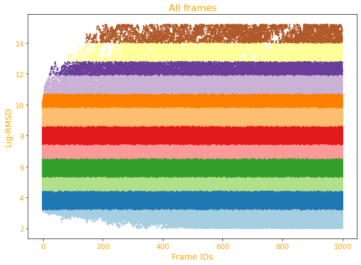
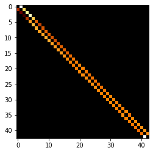
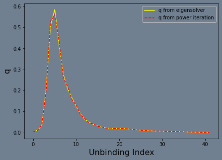
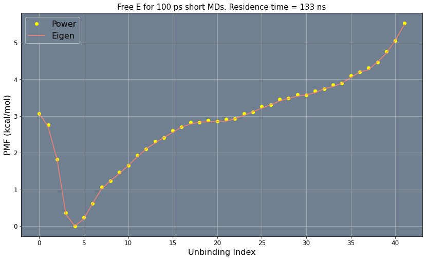

# Milestoning 1D

### In this notebook

1. We construct 1D milestones directly using short MD RMSDs for Asp that dissociat from bCD
2. Load ligand RMSDs of all short MDs
3. Label all points based on which microstate they belong in a 1D space
4. Estimate transition kernel $K_{ij}$
5. Calculate transition lifetimes between disks $\tau_i$
6. Performe steady state flux calculation $q_i$
7. Calculate free energy profile $F_i$

### Import libraries


```python
import numpy as np
import matplotlib.pyplot as plt
from BKit import TransitionKernel
from BKit import StateLabels_1D
```

### Load microstate labels of all short MDs


```python
dat_path = '../output/PCA/'
print("reading inputs from " + dat_path)
dat = np.load(dat_path + 'PCA.npy')
```

    reading inputs from ../output/PCA/


Th last column is ligand RMSD


```python
rmsd = dat[:,3] 
```


```python
n_frames = rmsd.shape[0] 
traj_size = 1000
```

### First, lets grab 1 trajectory, bin into states and plot


```python
traj_id = 1
bin_size = 0.3
labs_i = StateLabels_1D(rmsd[traj_id*traj_size: (traj_id+1)*traj_size], bin_size=bin_size)
```


```python
ts = 14
tcol='orange'
plt.figure(figsize=[10,7])
plt.scatter(list(range(traj_size)), labs_i[:,0], c=labs_i[:,1], s=3, cmap='Paired')
plt.xticks(size=ts-2, color=tcol)
plt.yticks(size=ts-2, color=tcol)
plt.title('Trajectory -- ' + str(traj_id), size=ts+2, color=tcol)
plt.xlabel('Frame IDs', size=ts, color=tcol)
plt.ylabel('Lig-RMSD', size=ts, color=tcol)
```


    Text(0, 0.5, 'Lig-RMSD')


    

    


```python

```

### Labe all frames and plot everything
    - None, plotting everything takes 1 min! 


```python
out = StateLabels_1D(rmsd, r_min=2.0, r_max=15.0, bin_size=bin_size)
```


```python
plt.figure(figsize=[10,7])
plt.scatter(out[:,2]%1000, out[:,0], c=out[:,1], s=3, cmap='Paired')
plt.xticks(size=ts-2, color=tcol)
plt.yticks(size=ts-2, color=tcol)
plt.xlabel('Frame IDs', size=ts, color=tcol)
plt.ylabel('Lig-RMSD', size=ts, color=tcol)
plt.title('All frames' , size=ts+2, color=tcol)

```


    Text(0.5, 1.0, 'All frames')


    

    


### Count transitions between states


```python
TransK = TransitionKernel(traj_size=traj_size, OutCellID=1000, check_escape=False)
```


```python
labs =  out[:,1]
TRANS, _ = TransK.AllTrans(labs)
```

    number of trajs 8603
    Total transitions =  490735


### Construct transition kernel


```python
nM = TRANS[:,2].max()
KMAT, time = TransK.Kmat_time(TRANS, nM, norm=True)
ave_time = np.array(time)[:,1]
```


```python
plt.imshow(KMAT, cmap='afmhot')
```


    <matplotlib.image.AxesImage at 0x7f468b85b9a0>


    

    


```python
KMAT=KMAT[0:nM-1,0:nM-1]
ave_time = ave_time[0:nM-1]
```

### Kinetics


```python
# Provide appropriative boundary condition to the last milestone
from BKit.KinSolvers import KineticsQK
nM = KMAT.shape[0]
bc_beg = ''
#bc_end = 'reflective'
bc_end = 'absorbing'

QK = KineticsQK(KMAT, ave_time, nM, bc = [bc_beg, bc_end])
PMF_power, q_power = QK.PowerIter(n_iters=20000)
PMF_eigen, q_eigen = QK.EigenSolver()

PMF_power = PMF_power - PMF_power.min()
PMF_eigen = PMF_eigen - PMF_eigen.min()
```

### Plot estimated flux vs unbinding indecies


```python
cl='slategrey'
fig=plt.figure(facecolor=cl, figsize=[7,5])
plt.rcParams['axes.facecolor'] = cl
plt.plot( range(len(q_eigen)), abs(q_eigen), color='yellow', label='q from eigensolver')
plt.plot( range(len(q_power)), q_power, '--',color='r', label='q from power iteration')
plt.legend()    
plt.xlabel('Unbinding Index', fontsize=16)
plt.ylabel('q', fontsize=16)
plt.show()
```


    

    


### Plot free energies


```python
b=0; f=nM-1
plt.figure(figsize=(14,8))
plt.plot(range(b,f+1), PMF_power, color='yellow', ls='', marker='o' )
plt.plot(range(b,f+1), PMF_eigen, color='salmon')
plt.title('Free E for 100 ps short MDs. Residence time = 133 ns', size=15)
plt.xlabel('Unbinding Index',fontsize=16)
plt.ylabel('PMF (kcal/mol)', fontsize=16)
plt.xticks(np.arange(b,(f+1), step=5), size=12)
plt.tick_params(labelsize=12)
plt.grid()
plt.legend(['Power','Eigen'], fontsize=16)
```


    <matplotlib.legend.Legend at 0x7f4688dc2550>


    

    


```python
time = np.array(time)
b_, f_ = np.argmin(PMF_power), np.argmax(PMF_power)
b = b_; f = f_
print("MFPT from milestone %s to %s:"%(b, f))
mfpt = abs( (q_power[b:f+1]*time[:,1][b:f+1]).sum() / q_power[-1]) / 10**9
print("MFPT =\t %E ms" % mfpt)
```

    MFPT from milestone 4 to 41:
    MFPT =	 1.695044E-04 ms


```python

```

### Thanks!


```python

```
